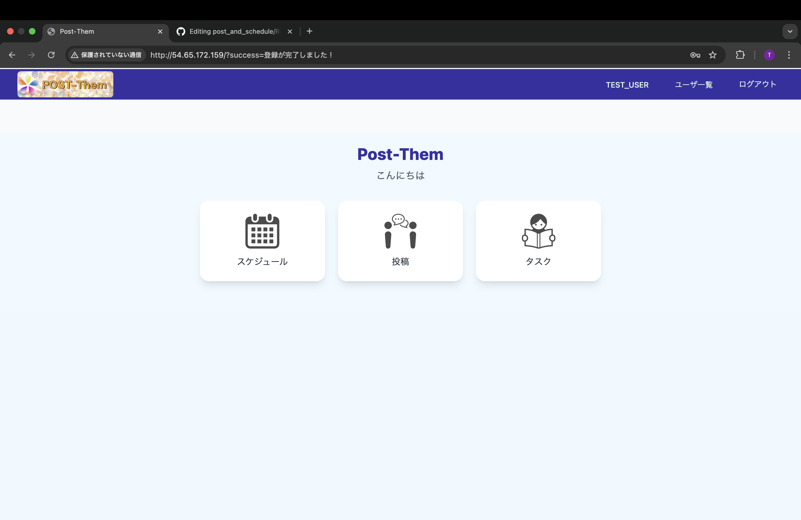
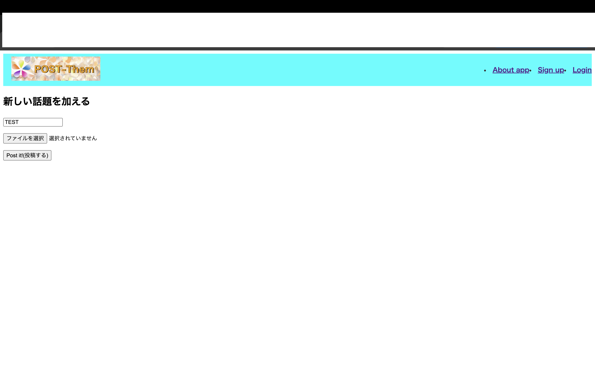
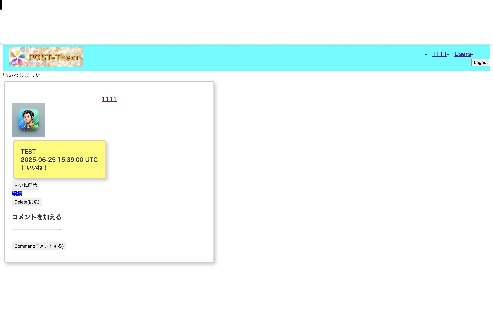
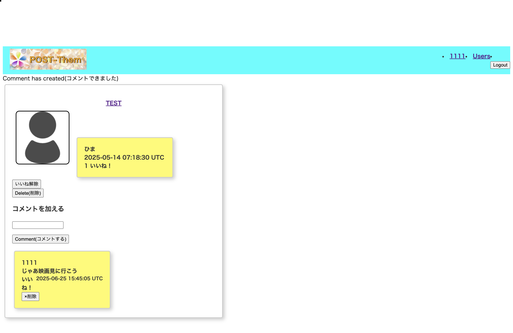
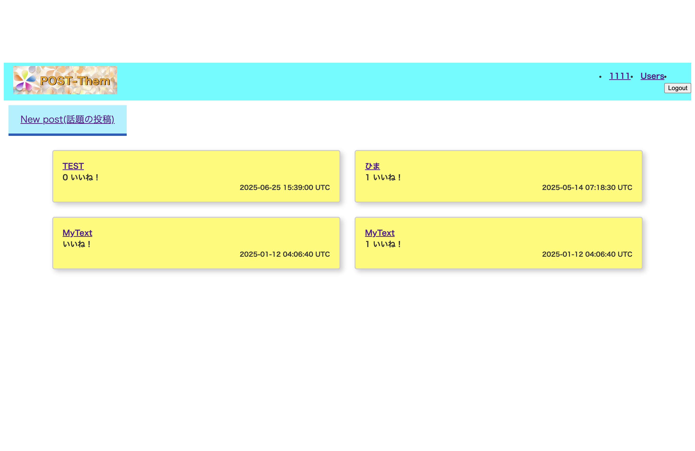
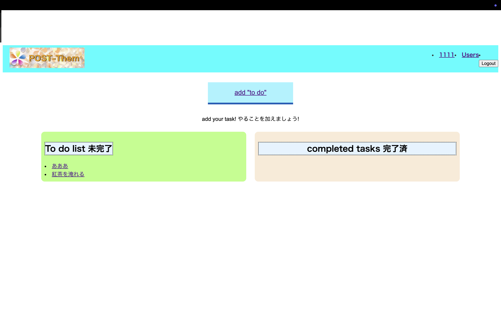
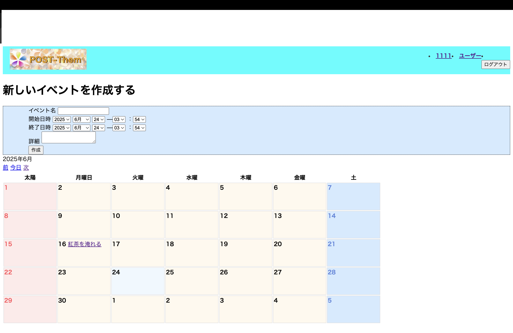
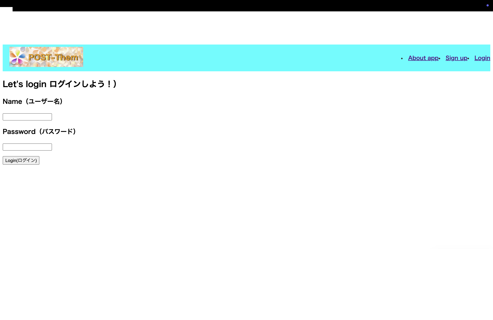

#  Post and Schedule

## 概要

Post and Schedule は、投稿・コメント・タスク・予定を一元管理できる Ruby on Rails 製の Web アプリケーションです。

趣味の音楽活動の中で、スケジュール調整やタスク共有、話題の管理が煩雑になっていた課題を解決するために開発しました。  
投稿機能やToDo管理、カレンダー連携など、日々のやり取りを効率化できる機能をまとめています。

## 制作の目的と背景

- 趣味の音楽仲間と共有するための「使える」アプリを目指し、設計・実装・UI改善を繰り返しました。
- 複数の機能（投稿、コメント、予定、ToDo）を連携させる実装力をアピールできるように意識しました。
- Webエンジニア（特にRailsやPython）としてのキャリアを目指し、未経験からでも実務に近い形のアプリケーション制作に取り組んでいます。

##  使用技術

- フレームワーク: Ruby on Rails 8.0.1
- 言語: Ruby, JavaScript, HTML, CSS
- フロントエンド: HTML, CSS, JavaScript（Turbo）
- データベース: PostgleSQL
- デプロイ: Render（※無料プラン使用経験あり）、AWS移行予定（2025年7月中）
- セキュリティ: brakeman（静的コード解析）
- 画像アップロード: ActiveStorage（アバター機能で使用）

##  主な機能

-   投稿（Post）
  - ユーザーによる自由な投稿（画像アップロード対応）
  - コメント・いいね機能付き
    
    

-   コメント（Comment）
  - 投稿に対するコメント
  - ユーザー間のやり取りが可能
    

-   いいね（Like）
  - 投稿へのリアクション機能
    

-   タスク管理（Task）
  - 日々のタスク登録・一覧表示
  - カレンダーと連携した可視化
    

-   イベント（Event）
  - スケジュールの追加・表示
  - タスクと合わせたカレンダー管理
  - 

-   ユーザー管理（User）
  - `if @user&.authenticate(params[:password])` による独自認証あり
    

##  ディレクトリ構成（主要部抜粋）

app/  
├── assets/  
├── controllers/  
├── javascript/  
├── jobs/  
├── mailers/  
├── models/  
└── views/  

##  セットアップ手順（開発環境）

git clone https://github.com/o-Ha-minor/post_and_schedule.git  
cd post_and_schedule  

bundle install  
rails db:create  
rails db:migrate  

rails s  

アクセス先：http://localhost:3000

##  投稿画像について

投稿に画像を添付可能。  
ファイルアップロードには ActiveStorage を使用。  
ユーザーのアバターなどでも活用中。

## UIの工夫

- 「ポストイット」風の明るく使いやすい見た目を意識してデザイン
- Bootstrapなどは使用せず、Rails標準の仕組みでスタイルを調整

##  今後の予定・ToDo

- [ ] Deviseによるユーザー認証の導入
- [ ] テストの追加（RSpec or Minitest）
- [ ] UI/UXの改善・デザイン統一
- [ ] READMEに画面キャプチャやGIFの追加
- [ ] AWSへの本番デプロイ対応

## デモリンク（準備中）

現在は非公開ですが、AWSまたはRenderでの再デプロイを予定しています。  
※2025年7月中に公開予定です。

## 👤 作者

- **名前**：o-Ha-minor
- **経歴**：事務職8年目 → ITエンジニア転職を目指して開発中  
- **資格**：基本情報技術者、ITパスポート、AWSクラウドプラクティショナー、Python3基礎
- **学習中**：Rails, Python, AWS, HTML/CSS, Photoshop
