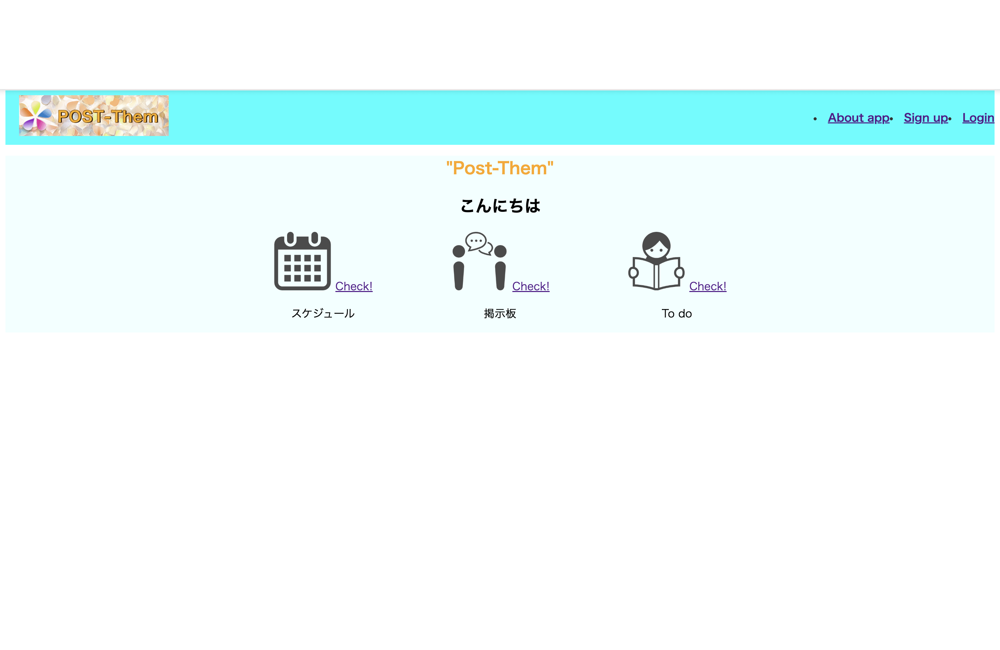

#  Post and Schedule(POST-Them)

## 概要

Post and Schedule は、投稿・コメント・タスク・予定を一元管理できる Ruby on Rails 製の Web アプリケーションです。

趣味の音楽活動の中で、スケジュール調整やタスク共有、話題の管理が煩雑になっていた課題を解決するために開発しました。  
投稿機能やToDo管理、カレンダー連携など、日々のやり取りを効率化できる機能をまとめています。

## 制作の目的と背景

- 趣味の音楽仲間と共有するための「使える」アプリを目指し、設計・実装・UI改善を繰り返しました。
- 複数の機能（投稿、コメント、予定、ToDo）を連携させる実装力をアピールできるように意識しました。
- Webエンジニア（特にRailsやPython）としてのキャリアを目指し、未経験からでも実務に近い形のアプリケーション制作に取り組んでいます。

##  使用技術

- フレームワーク: Ruby on Rails 8.0.1
- 言語: Ruby, HTML, CSS
- フロントエンド: HTML, CSS, Turbo
- データベース: PostgleSQL
- デプロイ: AWS EC2 (Nginx + Puma)
- セキュリティ: brakeman（静的コード解析）
- 画像アップロード: ActiveStorage（image機能で使用）

##  主な機能

-   投稿（Post）
  - ユーザーによる自由な投稿（画像添付に対応）
  - コメント・いいね機能付き
    
    

-   コメント（Comment）
  - 投稿に対するコメント機能
  - ユーザー間のやり取りが可能
    

-   いいね（Like）
  - 投稿へのリアクション機能
    

-   タスク管理（Task）
  - 日々のタスク登録・一覧表示
  - カレンダーと連携した可視化
    

-   イベント（Event）
  - スケジュールの追加・表示
  - タスクと合わせたカレンダー管理
  - 

-   ユーザー管理（User）
  - `if @user&.authenticate(params[:password])` を実装
    

-   グループ機能(Group)
  - グループを作成し、投稿・イベント・タスクを共有できる機能です。

##  ディレクトリ構成（主要部抜粋）
-   アプリURL（デプロイ済）
  - 本番環境はこちらからアクセス可能：
    http://54.65.172.159/
    ※AWS EC2（Ubuntu, Nginx, Puma）で構築・運用しています。

##  ディレクトリ構成（主要部抜粋）

app/  
├── assets/  
├── controllers/  
├── javascript/  
├── jobs/  
├── mailers/  
├── models/  
└── views/  

##  セットアップ手順（開発環境）

git clone https://github.com/o-Ha-minor/post_and_schedule.git  
cd post_and_schedule  

bundle install  
rails db:create  
rails db:migrate  

rails s  

アクセス先：http://localhost:3000

##  投稿画像について

投稿に画像を添付可能。  
ファイルアップロードには ActiveStorage を使用。  
ユーザーのアイコン画像でも活用中。

## UIの工夫

- 「付箋風」で親しみやすく、直感的なUIを意識してデザイン
- Rails標準とCSSでカスタマイズ

##  今後の予定・ToDo

- [△] UI/UXの改善・デザイン統一
- [⚪︎] READMEに画面キャプチャやGIFの追加
- [⚪︎] AWSへの本番デプロイ対応

## 👤 作者

- **名前**：o-Ha-minor
- **経歴**：事務職8年目 → ITエンジニア転職を目指して開発中  
- **資格**：応用情報技術者、基本情報技術者、ITパスポート、AWSクラウドプラクティショナー、Python3基礎
- **学習中**：Rails, Python, AWS, HTML/CSS, Photoshop
